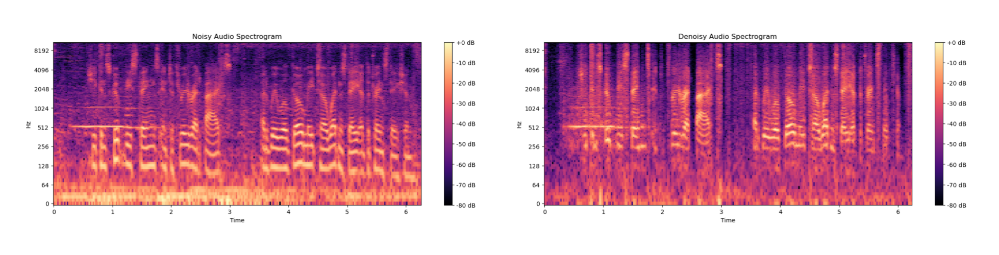
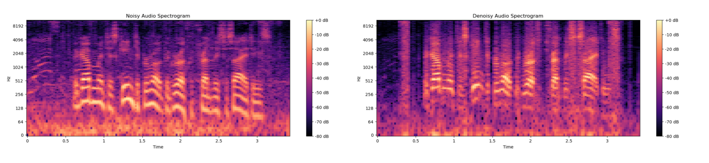
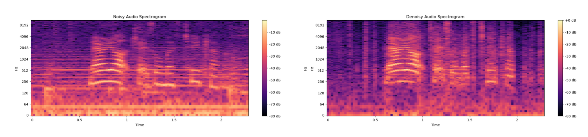
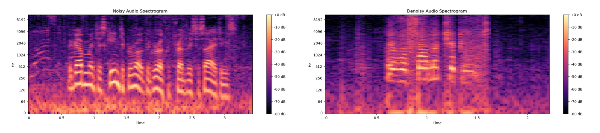

# Diffusion-Gaussian-Mixture-Audio-Denoise

## Abstract
Recent diffusion models achieved promising performances in audio-denoising tasks. The unique property of the reverse process could recover super clean signals. However, the distribution of real-world noises does not comply with single Gaussian distribution and is even unknown. The sampling of Gaussian noise conditions limits its application scenarios. In other words, one single Gaussian distribution is not enough to represent the original noise distribution. To overcome these challenges, this paper proposes DiffGMM, a denoising model based on the diffusion and Gaussian mixture models. We employ the reverse process to estimate parameters for the Gaussian mixture model. Given a noisy audio signal, we first use a 1D-U-Net to extract features and train linear layers to estimate parameters for the Gaussian mixing model, and we can approximate the real noise distribution. The noisy signal is continuously subtracted from the estimated noise to output clean audio signals. Extensive experimental results demonstrate that the proposed DiffGMM model achieves state-of-the-art performance.

## Samples

Let's hear the results converted back to sounds:

> Audios for VoiceBank + DEMAND example: 
> Example 1:

[Input example](https://github.com/PuWang-LP/Diffusion-Gaussian-Mixture-Audio-Denoise/assets/117755153/13a86efd-1037-4ecb-bd7c-6ee831012a7f)

[Predicted output example ](https://github.com/PuWang-LP/Diffusion-Gaussian-Mixture-Audio-Denoise/blob/main/audio/prediction_denoisy_audio/p232_005.wav)

> Example 2:

[Input example](https://github.com/PuWang-LP/Diffusion-Gaussian-Mixture-Audio-Denoise/blob/main/audio/noisy_audio/p232_007.wav)

[Predicted output example ](https://github.com/PuWang-LP/Diffusion-Gaussian-Mixture-Audio-Denoise/blob/main/audio/prediction_denoisy_audio/p232_007.wav)

> Example 3:

[Input example](https://github.com/PuWang-LP/Diffusion-Gaussian-Mixture-Audio-Denoise/blob/main/audio/noisy_audio/p232_293.wav)

[Predicted output example ](https://github.com/PuWang-LP/Diffusion-Gaussian-Mixture-Audio-Denoise/blob/main/audio/prediction_denoisy_audio/p232_293.wav)

> Example 4:

[Input example](https://github.com/PuWang-LP/Diffusion-Gaussian-Mixture-Audio-Denoise/blob/main/audio/noisy_audio/p257_426.wav)

[Predicted output example ](https://github.com/PuWang-LP/Diffusion-Gaussian-Mixture-Audio-Denoise/blob/main/audio/prediction_denoisy_audio/p257_426.wav)

> Example 5:

[Input example](https://github.com/PuWang-LP/Diffusion-Gaussian-Mixture-Audio-Denoise/blob/main/audio/noisy_audio/p257_432.wav)

[Predicted output example ](https://github.com/PuWang-LP/Diffusion-Gaussian-Mixture-Audio-Denoise/blob/main/audio/prediction_denoisy_audio/p257_432.wav)

Below some examples:

> Example 1:

> Example 2:

> Example 3:

> Example 4:

> Example 5:

## License

- **[MIT license](http://opensource.org/licenses/mit-license.php)**
